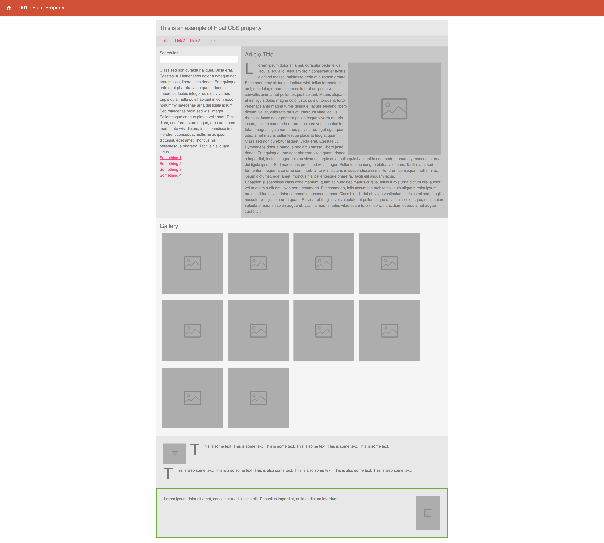

### 001 - Float Property

### Before 
You should read about Float CSS Property Documentation here:
[The Mystery Of The CSS Float Property][1]

#
The estimation for this practice is: 2 hours.
#

### To Do

Using Float CSS Property, create the next items:

Run the base project.

```sh
$ npm install http-server -g
$ cd u-css/
$ http-server ./src -p 3000
```

1. Please check and make the same design and animations than page has in the solution part, go there clicking in solution button from each box in the home view.
2. A horizontal nav bar menu.
3. Two columns below nav bar.
4. In the first column created, float an image with text wrapping it.
5. Below columns created, do a gallery of images. 



### Evaluation Criteria

1. Make it Readable.
2. Good Practices.
3. Use HTML5.
4. Structure Naming Convention.
5. Responsive skills are not required.
6. Use correct Cascade code.
7. Use correct Inheritance.
8. Goal: The practice should look as be required.


[1]: https://www.smashingmagazine.com/2009/10/the-mystery-of-css-float-property/
