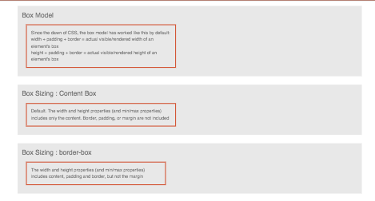

# 003 - Box Sizing

### Before 
You should read about Box Model Documentation here [CSS Tricks][1] and read about Box Sizing Documentation here [CSS Tricks][2].

### To Do

Create 2 container with:
- width: 1000px
- height: 80px;
- margin: 15px;
- padding: 15px;
- border: 5px solid #D24F2E;

1. First container using Content Box.
	
2. Second container using Box Sizing.

### Evaluation Criteria

1. Make it Readable.
2. Good Practices.
3. Use HTML5.
4. Structure Naming Convention.
5. Use correct Cascade code.
7. Use correct Inheritance.

 [1]: https://css-tricks.com/the-css-box-model/ 
 [2]: https://css-tricks.com/almanac/properties/b/box-sizing/
