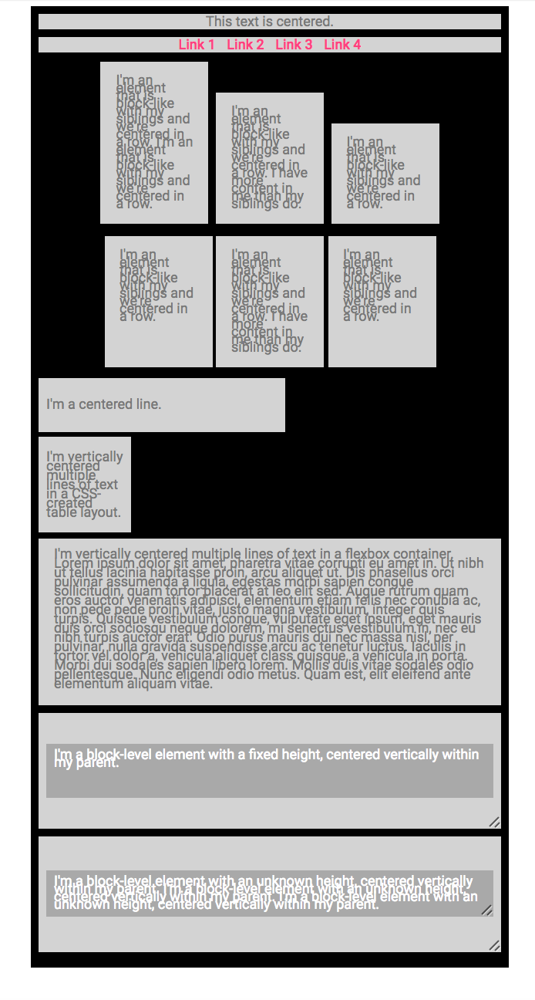

### 005 - Centering Components

### Before 
You should read about Centering Components Documentation here:

1. [CSS align][1]
2. [Centering CSS][2]
3. [Absolute Horizontal Vertical Centering CSS][3]
4. [Centering Elements with Flexbox][4]

### To Do

Using methods for Centering in CSS, create the next items:

1. A container with max width 1200px and centered horizontally. Use margin property.
2. A bar with a text centered.
3. A bar with 4 centered links.
4. Three centered block level elements with text inside.
5. Three centered elements with text inside using flexbox.
6. A single centered line of text using height and line height properties.
7. Center multiple lines of text using vertical align property.
8. Center multiple lines of text using flexbox.
9. A Block-level element with a fixed height, centered vertically within a parent.
10. A Block-level element with an unknown height, centered vertically within a parent.

The distribution of this example looks like:

[1]: https://www.w3schools.com/css/css_align.asp 
[2]: https://css-tricks.com/centering-css-complete-guide/ 
[3]: https://www.smashingmagazine.com/2013/08/absolute-horizontal-vertical-centering-css/ 
[4]: https://www.smashingmagazine.com/2013/05/centering-elements-with-flexbox/

