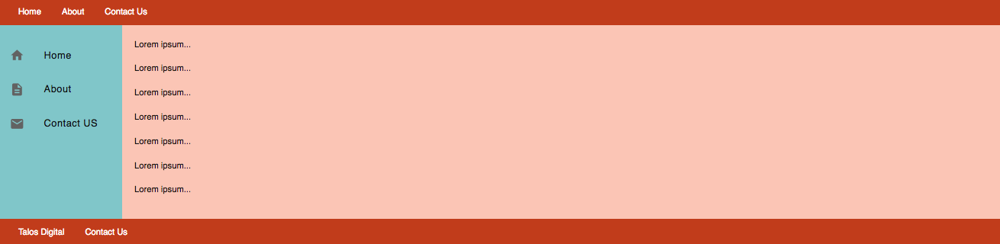

# 006 - Basic Layout

### Before 
You should read about Equal Heigh Column Layout here [Smashing Magazine][1]

#
The estimation for this practice is: 2 hours.
#

### To Do

Create a the following layout:

1. Using Equal Heigh Columns
2. Using Flex

#
 #####Check the design and animations in the solution part.
#

### Evaluation Criteria

1. Make it Readable.
2. Good Practices.
3. Use HTML5.
4. Structure Naming Convention.
5. Responsive skills are not required.
6. Use correct Cascade code.
7. Use correct Inheritance.
8. Goal: The practice should look as be required.

 [1]: https://www.smashingmagazine.com/2010/11/equal-height-columns-using-borders-and-negative-margins-with-css/
