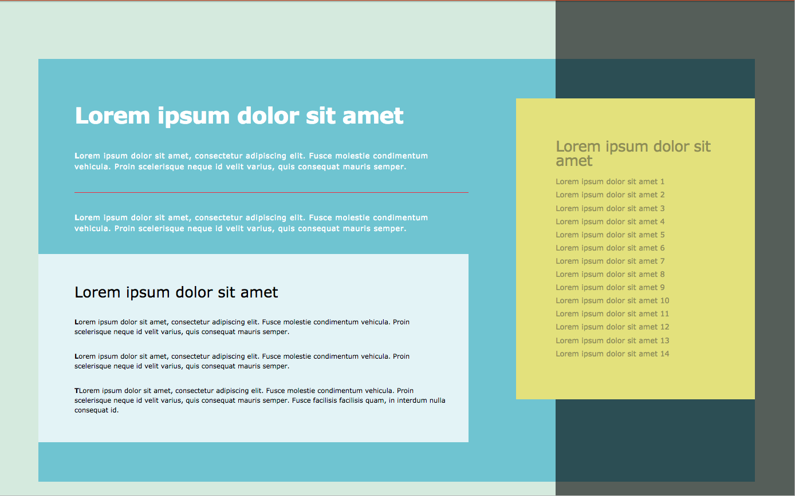

# 007- Z Index, !important and Inheritance

### Before 
You should read about Z Index Documentation here [CSS Tricks][1], about !important Documentation here [Smashing Magazine][2] and about Inheritance Documentation here [Smashing Magazine][3].

### To Do

Using Z Index, !important and Inheritance CSS Property, create the next items:

0. Use all the text sans-serif and letter-spacing normal, the articles, nav, section display block.
1. Create a container with background color #96baba. 
2. Create a new container overlapping the first one background color lightskyblue.
3. In this container create a header with a sub title and an article and 2 text divide by a line.
4. Create 2 new containers overlapping the second one with 0.8 opacity.
5. The first container should have a title and 3 paragraph and be white
6. And the second container should be yellow and have a list with 10 elements and odd should be bold excepting the first element.

 [1]: https://css-tricks.com/almanac/properties/z/z-index/
 [2]: https://www.smashingmagazine.com/2010/11/the-important-css-declaration-how-and-when-to-use-it/
 [3]: https://www.smashingmagazine.com/2016/11/css-inheritance-cascade-global-scope-new-old-worst-best-friends/
