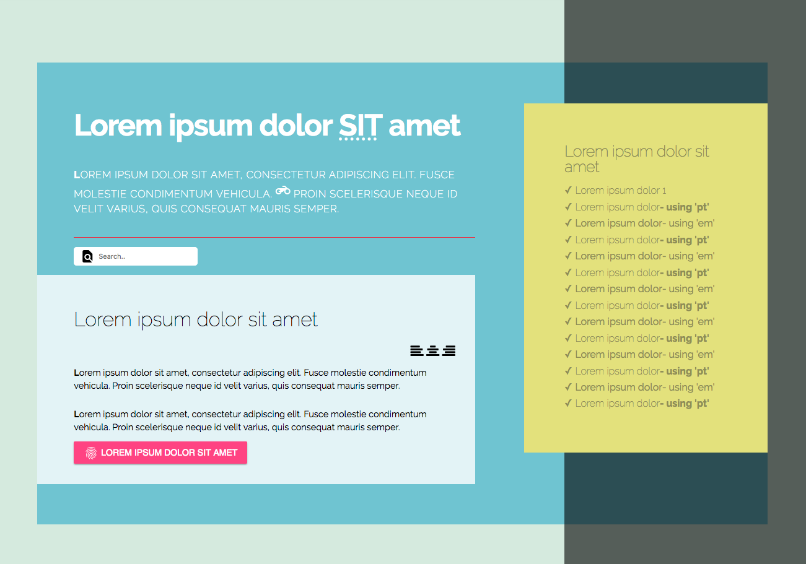

# 009 Fonts, Icons and Sizes

### Before 
You should read about Font Size Documentation here [Kyle Schaeffer][1], about Font Size Properties here [CSS Tricks][2], about Fluid Typography here [CSS Tricks][3] and about Using @font-face here [CSS Tricks][4].

#
The estimation for this practice is: 1 hours.
#

### To Do

Continue the Z Index, !important and Inheritance exercice in which we are going to change some labels using Fonts, Icons and Sizes.

Create a the following layout:
 

#
 #####Check the design and animations in the solution part.
#

### Evaluation Criteria

1. Make it Readable.
2. Good Practices.
3. Use HTML5.
4. Structure Naming Convention.
5. Responsive skills screens from 320px to 1440px.
6. Use correct Cascade code.
7. Use correct Inheritance.
8. Goal: The practice should look as be required.
 
[1]: http://kyleschaeffer.com/development/css-font-size-em-vs-px-vs-pt-vs/
[2]: https://css-tricks.com/almanac/properties/f/font-size/
[3]: https://css-tricks.com/snippets/css/fluid-typography/
[4]: https://css-tricks.com/snippets/css/using-font-face/
[5]: http://fontawesome.io/icons/
[6]: https://material.io/icons/
