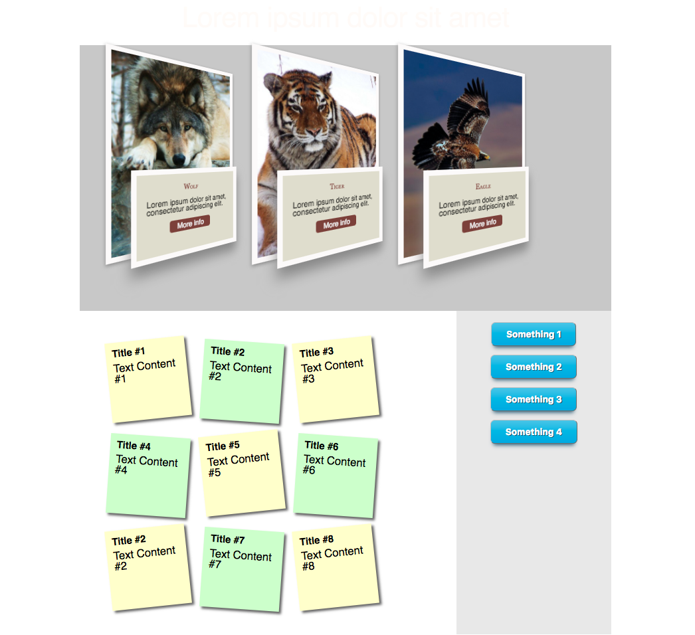

# 016 - Bootstrap and Material Column System

### Before 
You should read about Bootstrap here [V4 Alpha][2], about Responsive Web Design here [Smashing Magazine][1], about Material here [Material][3] and about Material AngularJS here [Material Angularjs][4].

### To Do

1. 

 [1]: https://www.smashingmagazine.com/2011/01/guidelines-for-responsive-web-design/ 
 [2]: https://v4-alpha.getbootstrap.com/layout/grid/
 [3]: https://material.io/guidelines/layout/responsive-ui.html#
 [4]: https://material.angularjs.org/latest/layout/introduction
